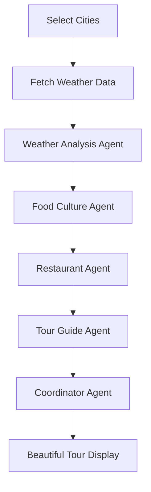

# 🍜 Weather-Aware Foodie Tours

A sophisticated AI-powered application that creates personalized food tours based on real-time weather conditions. Discover authentic local cuisine tailored to current weather patterns using advanced AI agents and live weather data.

## 🌟 Features

- **Real-time Weather Integration**: Fetches live weather data from OpenWeatherMap API
- **AI-Powered Recommendations**: Uses Julep AI agents to create personalized food experiences
- **Weather-Adaptive Dining**: Suggests indoor/outdoor dining based on current conditions
- **Multi-City Support**: Generate tours for multiple cities simultaneously
- **Beautiful UI**: Modern, responsive interface with gradient designs and animations
- **Downloadable Guides**: Export your tours as formatted markdown files

## 🏗️ Architecture

### Core Components

```
┌─────────────────┐    ┌─────────────────┐    ┌─────────────────┐
│   Weather API   │    │   Julep AI      │    │   Streamlit     │
│   (Real-time    │◄──►│   (5 Agents)    │◄──►│   (Frontend)    │
│   conditions)   │    │                 │    │                 │
└─────────────────┘    └─────────────────┘    └─────────────────┘
```

### AI Agents Workflow

1. **Weather Oracle** 🌤️ - Analyzes weather data and provides dining recommendations
2. **Food Culture Guru** 🍜 - Suggests weather-appropriate local dishes
3. **Restaurant Detective** 🏨 - Finds suitable restaurants based on conditions
4. **Storytelling Tour Guide** 📖 - Creates engaging tour narratives
5. **Experience Coordinator** 🎯 - Combines everything into a comprehensive guide

## 📁 Project Structure

```
foodie-tour-app/
├── app.py                 # Main Streamlit application
├── weather_service.py     # Weather API service
├── julep_service.py       # Julep AI service
├── utils.py              # Utility functions
├── styles.css            # CSS styling
├── templates.html        # HTML templates
├── test_weather_api.py   # API testing script
├── .env                  # Environment variables (create this)
├── requirements.txt      # Dependencies
└── README.md            # This file
```

## 🚀 Quick Start

### Prerequisites

- Python 3.8+
- OpenWeatherMap API key (free)
- Julep AI API key

### Installation

1. **Clone or download the project**
   ```bash
   mkdir foodie-tour-app
   cd foodie-tour-app
   ```

2. **Install dependencies**
   ```bash
   pip install -r requirements.txt
   ```

3. **Set up environment variables**
   ```bash
   cp .env.example .env
   ```
 
   Edit `.env` file and add your API keys:
   ```env
   OPENWEATHER_API_KEY=your_32_character_api_key_here
   JULEP_API_KEY=your_julep_api_key_here
   ```

4. **Test your weather API key**
   ```bash
   python test_weather_api.py
   ```

5. **Run the application**
   ```bash
   streamlit run app.py
   ```

## 🔑 API Keys Setup

### OpenWeatherMap API Key

1. Visit [openweathermap.org/api](https://openweathermap.org/api)
2. Sign up for a free account
3. Go to "API keys" section
4. Copy your API key (32 characters)
5. **Important**: New keys take up to 2 hours to activate!

### Julep AI API Key

1. Visit [julep.ai](https://julep.ai)
2. Create an account
3. Get your API key from the dashboard
4. Add to your `.env` file

## 🎯 How It Works

### Step-by-Step Workflow



1. **City Selection**: Choose from popular cities or add custom locations
2. **Weather Fetching**: Real-time weather data including temperature, conditions, rain probability
3. **AI Analysis**: 5 specialized agents work together:
   - Analyze weather for dining recommendations
   - Suggest weather-appropriate local dishes
   - Find suitable restaurants (indoor/outdoor based on conditions)
   - Create engaging tour narratives
   - Coordinate everything into a comprehensive guide
4. **Beautiful Display**: Present tours with styled cards, weather displays, and downloadable guides

### Weather-Based Recommendations

- **☀️ Sunny & Warm (>25°C)**: Air-conditioned venues, cold dishes, outdoor terraces
- **🌧️ Rainy (>70% chance)**: Indoor dining, comfort food, cozy atmospheres
- **❄️ Cold (<15°C)**: Warm dishes, heated spaces, hot beverages
- **🌤️ Perfect Weather (15-25°C, clear)**: Outdoor dining, street food, rooftop restaurants

## 🎨 Features Breakdown

### Weather Integration
- **Live Data**: Current temperature, humidity, wind speed
- **Forecasting**: Rain probability for next 12 hours
- **Smart Recommendations**: Indoor/outdoor dining suggestions
- **Visual Display**: Beautiful weather cards with emojis and gradients

### AI-Powered Content
- **Cultural Context**: Local food traditions and significance
- **Weather Adaptation**: Dishes perfect for current conditions
- **Restaurant Matching**: Venues suited to weather (covered/open-air)
- **Narrative Creation**: Engaging, story-driven tour guides

### User Experience
- **Multi-City Tours**: Generate multiple tours simultaneously
- **Responsive Design**: Works on desktop and mobile
- **Progress Tracking**: Real-time updates during generation
- **Export Options**: Download tours as markdown files

## 🛠️ Troubleshooting

### Common Issues

1. **Weather API Key Error**
   ```
   Solution: Check if your API key is 32 characters and activated (wait 2 hours for new keys)
   ```

2. **No Weather Data**
   ```
   Solution: Verify city name spelling and internet connection
   ```

3. **AI Agent Errors**
   ```
   Solution: Check Julep API key and account status
   ```

4. **Styling Issues**
   ```
   Solution: Ensure styles.css is in the same directory as app.py
   ```

### Debug Mode

Enable debug mode in `.env`:
```env
DEBUG=True
```

This shows additional information like API URLs and response codes.

## 📋 Requirements

```txt
streamlit>=1.28.0
julep>=1.0.0
requests>=2.31.0
python-dotenv>=1.0.0
```

## 🎨 Customization

### Adding New Cities
Edit the `popular_cities` list in `app.py`:
```python
popular_cities = [
    "Tokyo", "Paris", "New York", "Bangkok", "Istanbul",
    "Your City Here"  # Add your city
]
```

### Modifying Styling
Edit `styles.css` to customize:
- Colors and gradients
- Card designs
- Animations
- Responsive breakpoints

### Extending AI Agents
Add new agents in `julep_service.py`:
```python
agents["new_agent"] = client.agents.create(
    name="New Agent Name",
    model="claude-3.5-sonnet",
    about="Agent description and role"
)
```

## 🤝 Contributing

1. Fork the repository
2. Create a feature branch
3. Make your changes
4. Test thoroughly
5. Submit a pull request


## 🆘 Support

If you encounter issues:

1. **Check the troubleshooting section** above
2. **Run the test script**: `python test_weather_api.py`
3. **Enable debug mode** in your `.env` file
4. **Verify API keys** are correct and activated

## 🌟 Acknowledgments

- **OpenWeatherMap** for weather data API
- **Julep AI** for intelligent agent framework
- **Streamlit** for the beautiful web interface
- **Claude AI** for powering the food recommendations

---
## Output Images


**Made with ❤️ for food lovers and weather enthusiasts!** 🍜🌤️
